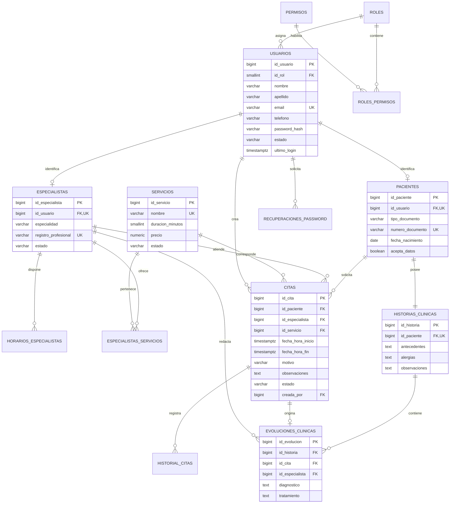

# Modelo de datos de ORAL LUANM

Este modelo traduce las funciones que hoy usan `localStorage` a entidades persistentes
para PostgreSQL. El script ejecutable está en `database/schema.sql`.



## Contrato mínimo para el backend

Base sugerida: `/api/v1`. Las contraseñas nunca se devuelven y se almacenan únicamente
como hash Argon2id o bcrypt.

| Método | Endpoint | Uso en el frontend |
|---|---|---|
| `POST` | `/auth/login` | Reemplaza `MOCK_USERS` y crea la sesión |
| `POST` | `/auth/logout` | Cierra o invalida la sesión |
| `POST` | `/auth/registro` | Registra usuario y paciente |
| `POST` | `/auth/recuperaciones` | Solicita recuperación de contraseña |
| `GET` | `/usuarios` | Panel administrativo |
| `POST` | `/usuarios` | Crear usuario interno |
| `PATCH` | `/usuarios/{id}` | Actualizar rol o estado |
| `GET` | `/pacientes` | Selector y gestión de pacientes |
| `POST` | `/pacientes` | Crear paciente desde la agenda |
| `GET` | `/especialistas` | Lista de especialistas |
| `POST` | `/especialistas` | Alta desde administración |
| `GET` | `/servicios` | Motivos/servicios disponibles |
| `GET` | `/citas?desde=&hasta=&especialistaId=` | Agenda filtrada |
| `POST` | `/citas` | Asignar cita |
| `PATCH` | `/citas/{id}` | Editar, confirmar o cancelar |
| `GET` | `/roles` | Roles y permisos disponibles |
| `PUT` | `/roles/{id}/permisos` | Actualizar permisos |

### Forma mínima de una cita

```json
{
  "idPaciente": 15,
  "idEspecialista": 3,
  "idServicio": 2,
  "fechaHoraInicio": "2026-07-10T09:30:00-05:00",
  "motivo": "Control de ortodoncia",
  "observaciones": "Control mensual"
}
```

El backend calcula `fechaHoraFin` usando la duración del servicio y debe rechazar
solapamientos para un mismo especialista. La restricción única del SQL evita dos citas
con la misma hora inicial; el servicio debe validar también cruces parciales.

## Correspondencia con el frontend actual

| Estado actual | Reemplazo persistente |
|---|---|
| `oralLuanmUser` | Sesión segura y respuesta de `/auth/login` |
| `oralLuanmAppointments` | Tabla `citas` |
| `oralLuanmAdminUsers` | Tablas `usuarios`, `roles` |
| `oralLuanmSpecialists` | Tablas `especialistas`, `usuarios` |
| `oralLuanmTeamPermissions` | Tablas `permisos`, `roles_permisos` |

## Decisiones pendientes antes de conectar

1. Elegir el framework del backend (por ejemplo Spring Boot, NestJS o Express).
2. Definir si la autenticación será por cookie de sesión o JWT en cookie `HttpOnly`.
3. Confirmar si la historia clínica entra en la primera versión y sus reglas de acceso.
4. Crear migraciones con la herramienta del framework en lugar de ejecutar el SQL
   manualmente en producción.
